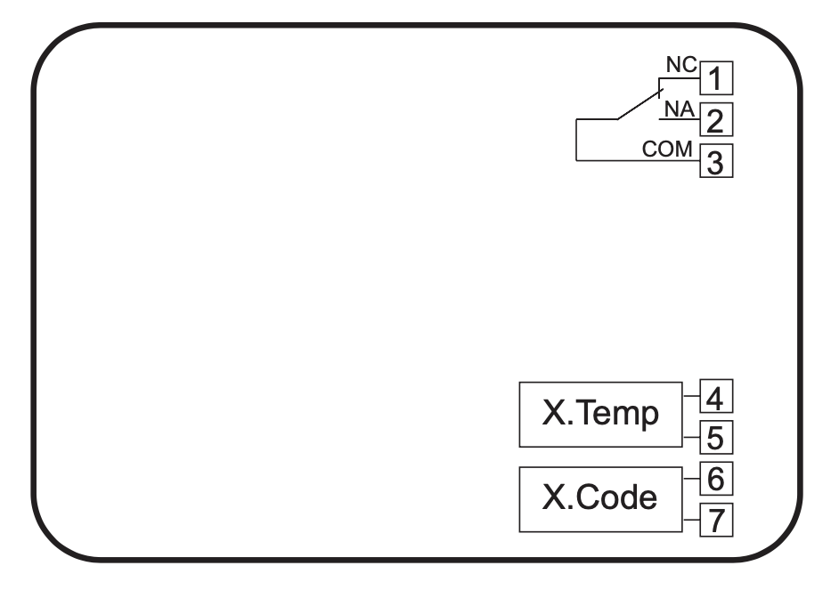
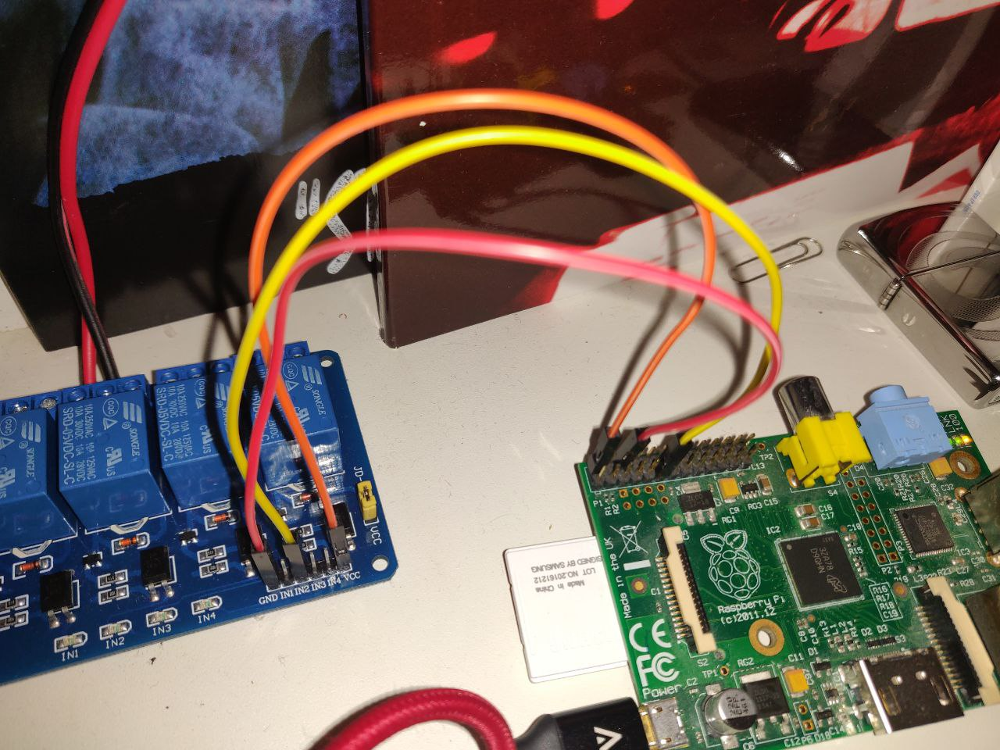
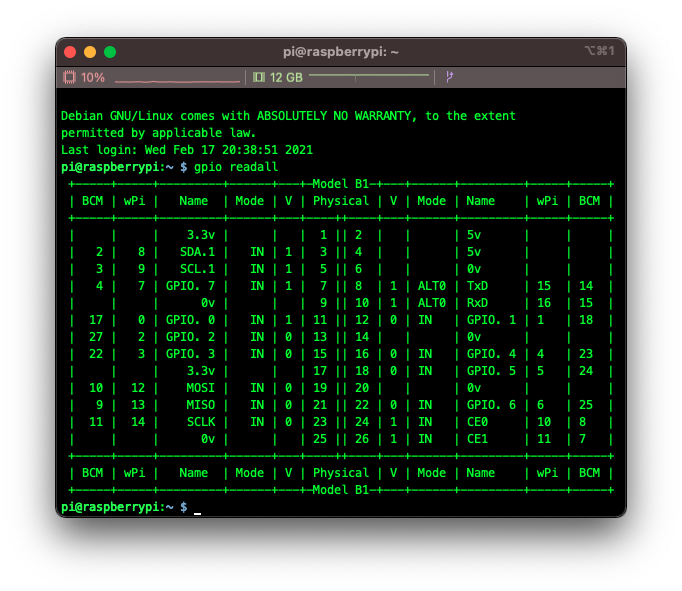
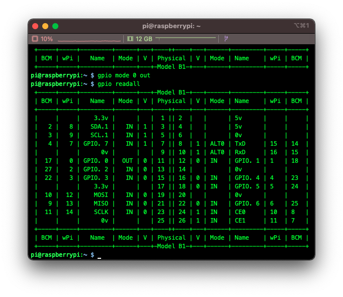
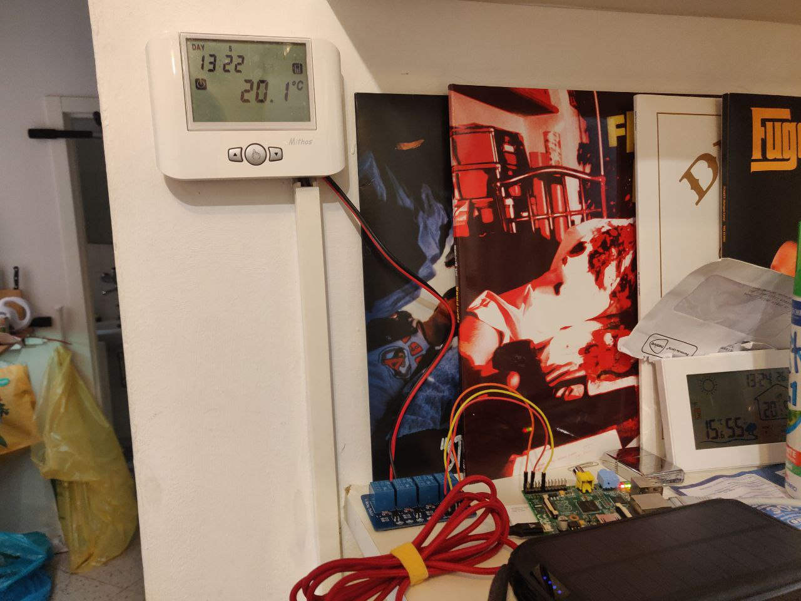

# CaldaiaPi - Controlling a Vemer Mithos thermostat through a Raspberry Pi

I freaking hate coming back home and freezing. We'll try to smarten my old thermostat a bit.

## Connecting the pins

The Mithos has a "telephone dialer" pin that we can exploit to remotely turn on and off the heatening:

They added it to sell more *Vemer X.Code* dialers, but in the end what we care about is that by closing pins 6 and 7 we can turn off my home heatening. So far so good.

Using my Raspberry Pi 0 and a relay module (you can find them on [Amazon](https://amzn.to/3qXFsJD)), we should be able to do so.

We'll connect pins 6 and 7 to the NC and COM of the relay module, then connect the VCC to the Pi's 5V, the GND to the Pi's GND, and the IN to the Pi's GPIO Pin 0 (aka pin 17).



## How do we actually use this?

When the relay is closed, the heatening is OFF.

When the Pi is powered off and after startup, the pin is in IN mode, on value 1, and the heatening is turned OFF.

This is the GPIO state when the heatening is OFF:



To turn on the heatening, we first have to set the pin to OUT. To do so:

```bash
gpio mode 0 out
```

This sets the pin to 0, and therefore **turns on the heatening**.



When the pin is set to 0, the heatening is ON. If the heatening is ON and the pin is in OUT mode, we can turn it OFF by using `gpio write 0 1`.

## Automating this shit

Nobody likes to SSH home to heat it up. I'm currently working on a Python script that pings my Macbook to get if I get home (nobody goes out without their Macbook, right?).

This is currently WIP.

## Final setup

This is it! No more freezing in the Bolognese winter.

